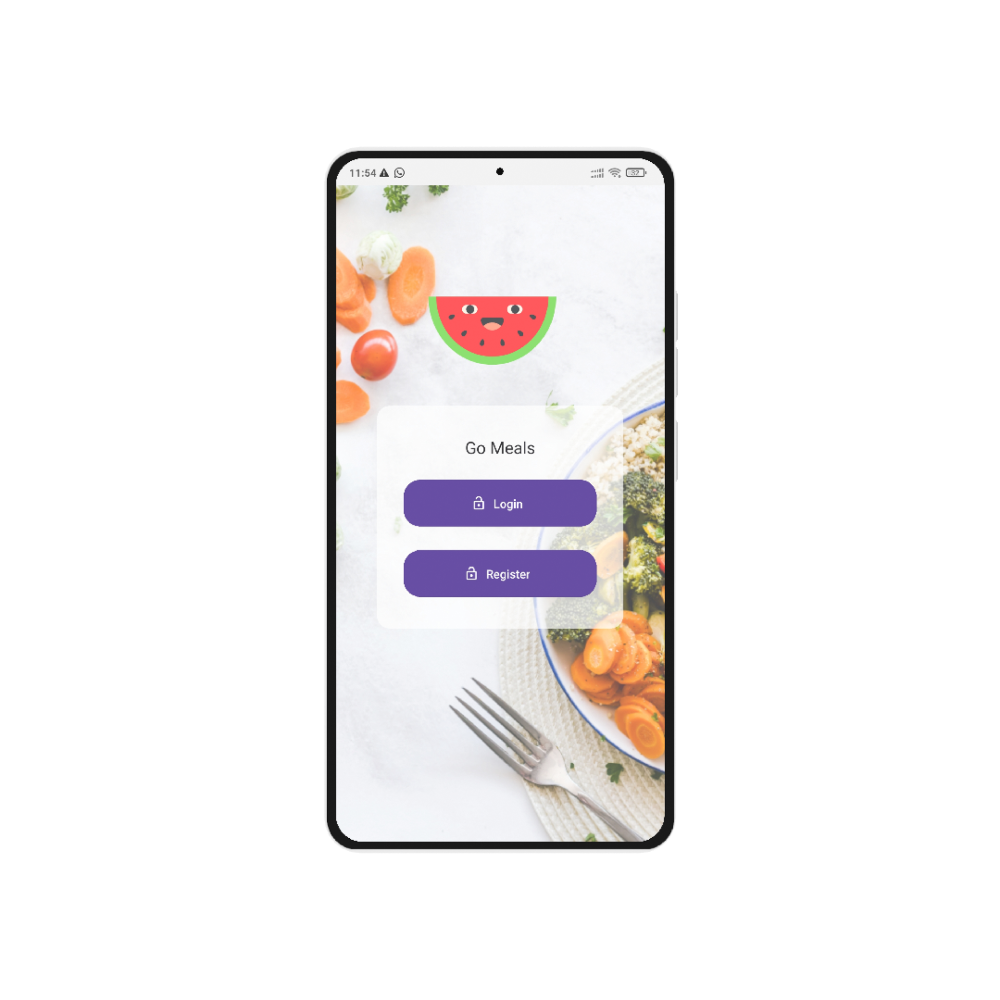
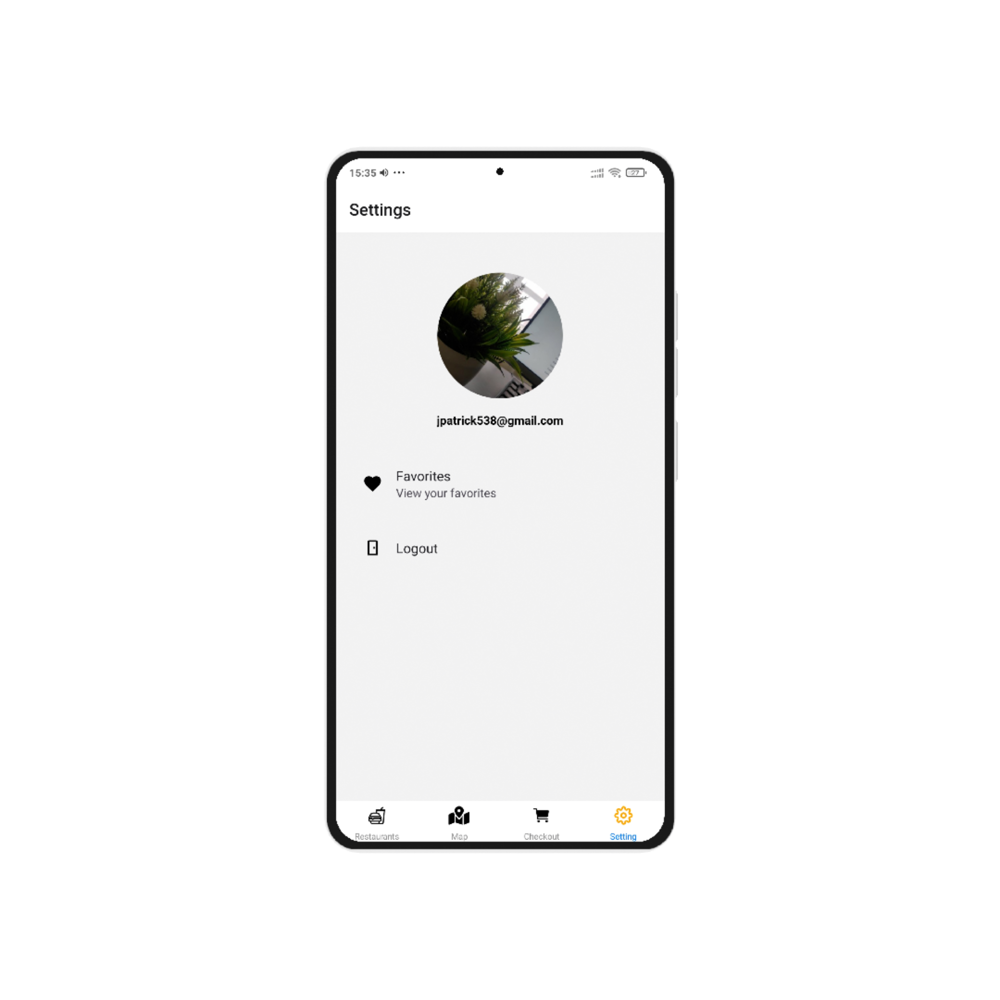
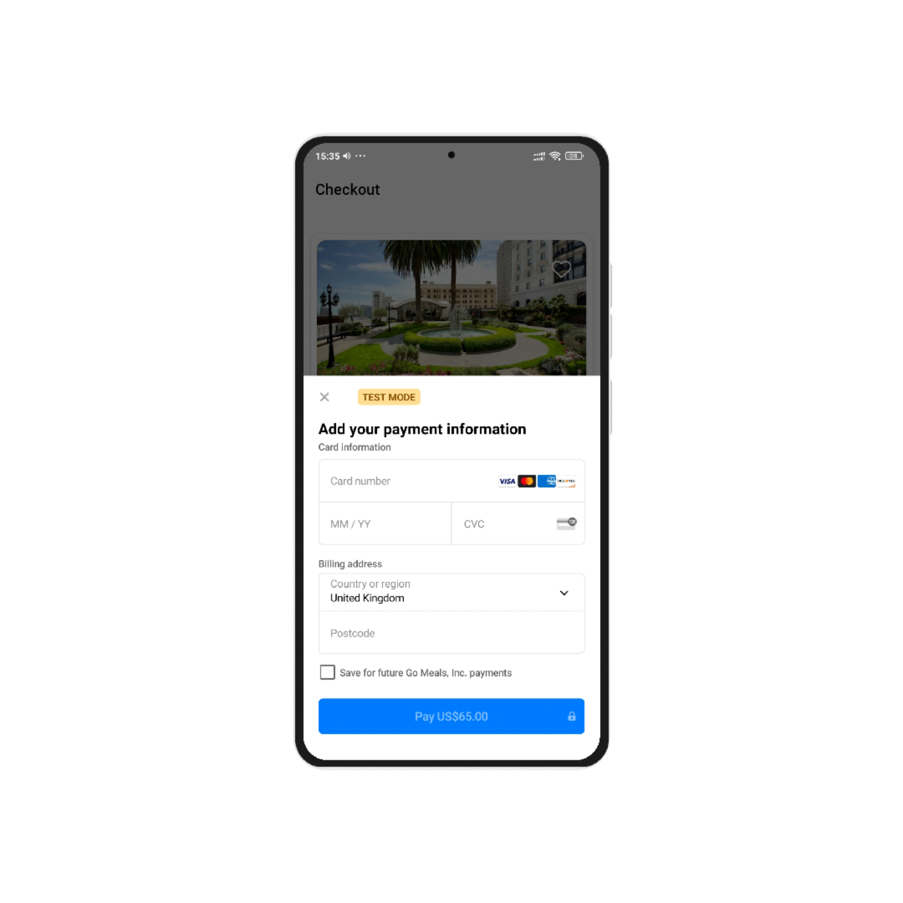
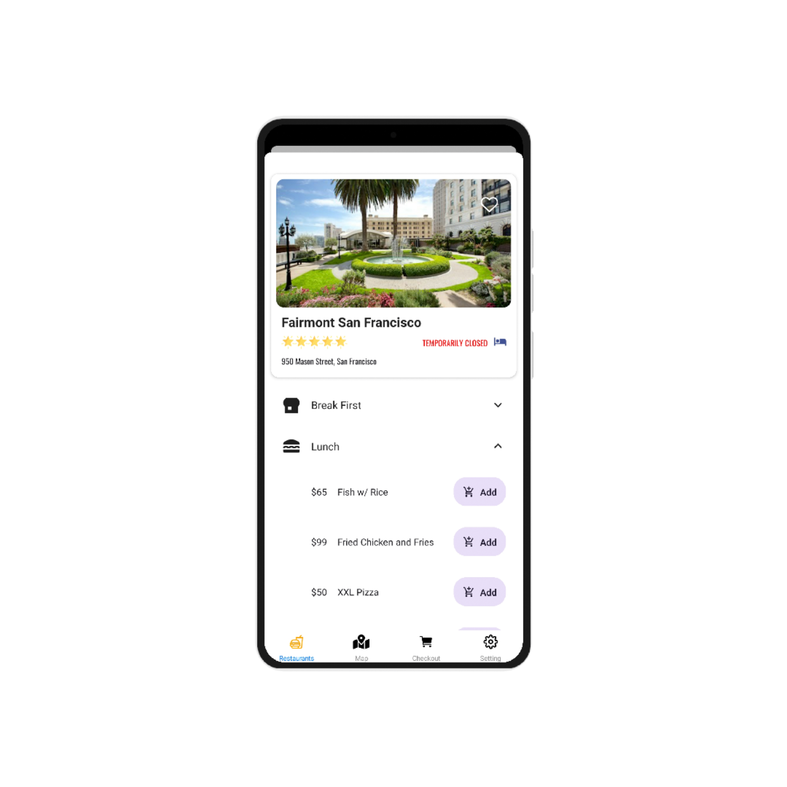
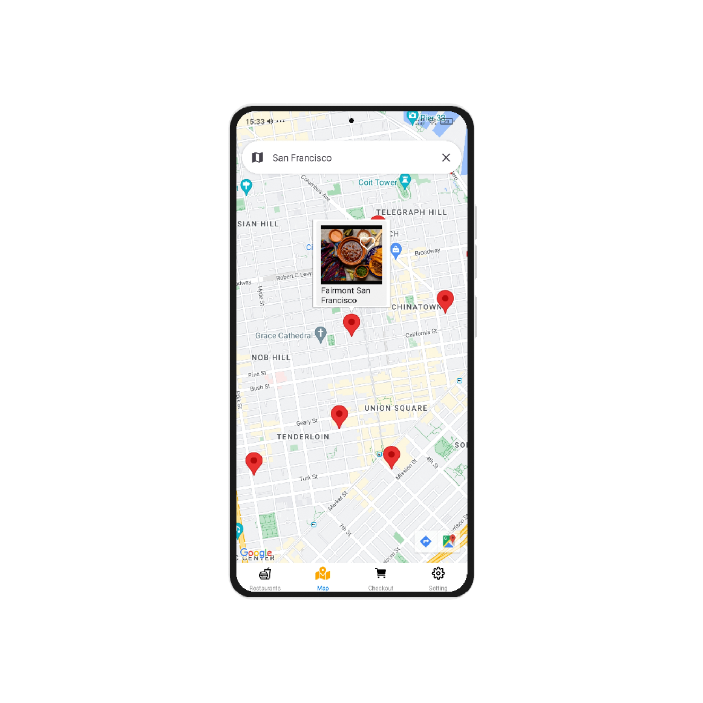
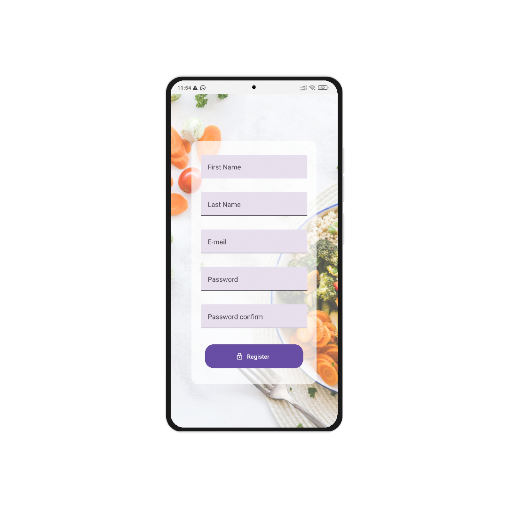
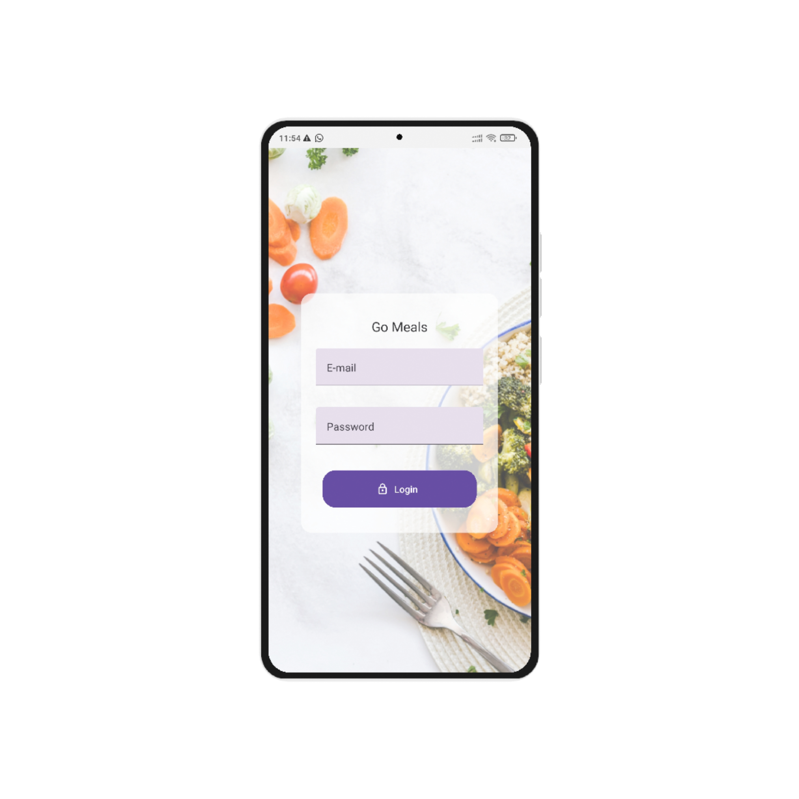

# 📗 Table of Contents

- [📖 About the Project](#about-project)
  - [🛠 Built With](#built-with)
    - [Tech Stack](#tech-stack)
    - [Key Features](#key-features)
  - [🚀 Live Demo](#live-demo)
- [💻 Getting Started](#getting-started)
  - [Prerequisites](#prerequisites)
  - [Setup](#setup)
  - [Install](#install)
  - [Usage](#usage)
  - [Run tests](#run-tests)
  - [Deployment](#triangular_flag_on_post-deployment)
- [👥 Authors](#authors)
- [🔭 Future Features](#future-features)
- [🤝 Contributing](#contributing)
- [⭐️ Show your support](#support)
- [🙏 Acknowledgements](#acknowledgements)
- [❓ FAQ (OPTIONAL)](#faq)
- [📝 License](#license)

<!-- PROJECT DESCRIPTION -->

# 🍕 GoMeals <a name="about-project"></a>

**Gomeals** is a React Native food ordering app built with TypeScript and Expo. It integrates Firebase for authentication, Context API for state management, Stripe for payments, and Google Maps for mapping services. The backend is handled by Firebase Functions.

## 🛠 Built With <a name="built-with"></a>

- **React Native**
- **TypeScript**
- **Expo**
- **Firebase (Authentication and Functions)**
- **Context API**
- **Stripe**
- **Google Maps**
## 🖼️ Screenshots

 
 <br>
 
 <br>
 
 <br>
 
 <br>
 
 <br>
 
 <br>
 
 <br>
 
 <br>
 
 <br>
<br>

### Key Features <a name="key-features"></a>
- **View and Search for Restaurants**
- **Mapping Services with Google Maps**
- **Authentication with Firebase**
- **Payment Integration with Stripe**
- **Add favourites**
- **Camera Module**

<p align="right">(<a href="#readme-top">back to top</a>)</p>

<!-- LIVE DEMO -->

## 🚀 Live Demo <a name="[live-demo](https://expo.dev/artifacts/eas/x88AE1oikhXNs8uVfcGLzP.apk)"></a>
- [Live Demo]([Download Apk](https://expo.dev/artifacts/eas/x88AE1oikhXNs8uVfcGLzP.apk))
<p align="right">(<a href="#readme-top">back to top</a>)</p>

## 💻 Getting Started <a name="getting-started"></a>

### Prerequisites

In order to run this project, you need:

- Visual Studio Code
- Node.js
- Expo CLI
- Firebase account
- Stripe account

### Setup

Clone this repository to your desired folder:

```sh
cd <desired folder to contain project>
git clone https://github.com/johnpatrick254/GoMeals
cd <project_folder>
```

### Install

Install project dependencies:

```sh
npm install
```

### Usage

Start the Expo development server:

```sh
expo start
```

<!-- Add any additional instructions here, such as setting up Firebase credentials, etc. -->

<p align="right">(<a href="#readme-top">back to top</a>)</p>

<!-- AUTHORS -->

## 👥 Authors <a name="authors"></a>

👤 **JOHN PATRICK**

- GitHub: [@johnpatrick254](https://github.com/johnpatrick254)
- Bitbucket: [@johnpat1](https://bitbucket.org/johnpat1/workspace/overview/)
- Twitter: [@jpattrick538](https://twitter.com/jpattrick538_)
- LinkedIn: [john-patrick-254-ke](https://www.linkedin.com/in/john-patrick-254ke/)

<!-- Add additional authors as needed -->

<p align="right">(<a href="#readme-top">back to top</a>)</p>

<!-- FUTURE FEATURES -->

## 🔭 Future Features <a name="future-features"></a>

- **Order History**

<p align="right">(<a href="#readme-top">back to top</a>)</p>

<!-- CONTRIBUTING -->

## 🤝 Contributing <a name="contributing"></a>

Contributions, issues, and feature requests are welcome!

<p align="right">(<a href="#readme-top">back to top</a>)</p>

<!-- SUPPORT -->

## ⭐️ Show your support <a name="support"></a>

If you found this project useful, please consider giving it a star on GitHub!

<p align="right">(<a href="#readme-top">back to top</a>)</p>

<!-- ACKNOWLEDGEMENTS -->

## 🙏 Acknowledgments <a name="acknowledgements"></a>

<!-- > Give credit to everyone who inspired your codebase. -->

<p align="right">(<a href="#readme-top">back to top</a>)</p>

<!-- FAQ (optional) -->

<!-- ## ❓ FAQ (OPTIONAL) <a name="faq"></a>

<!-- > Add at least 2 questions new developers would ask when they decide to use your project. -->

<!-- - **[Question_1]**

  - [Answer_1]

- **[Question_2]**

  - [Answer_2]

<p align="right">(<a href="#readme-top">back to top</a>)</p> -->

<!-- LICENSE -->

## 📝 License <a name="license"></a>

This project is [MIT](./MIT.md) licensed.

<p align="right">(<a href="#readme-top">back to top</a>)</p>
```
